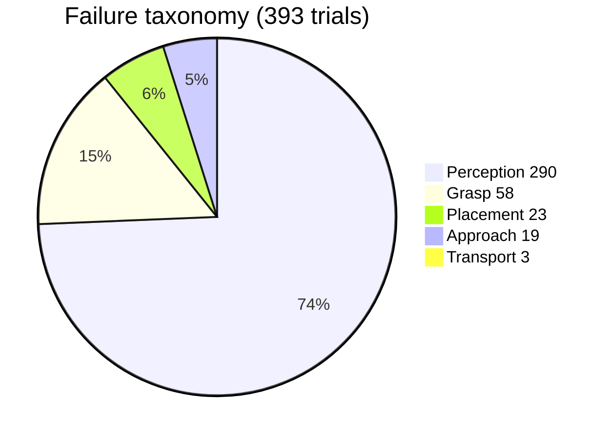

# Reall2Policy

End-to-end real-world robot learning on LeRobot SO-101.

<!-- readme:tagline:start -->
`100 demonstrations (target 100) · ACT E03 100K · Diffusion Policy · SmolVLA · OOD Generalization`
<!-- readme:tagline:end -->

<!-- readme:footnote:start -->
> 进度由 `lab-log/metrics.json` 生成；实验数字以 `experiments/INDEX.md` 与 `results/` 为准，未测完不写成功率。
<!-- readme:footnote:end -->

## Demo

<table>
  <tr>
    <td align="center" valign="top">
      
      <br />
      Leader臂（黑）不动 | Follower臂（白）独自抓放，远视角
    </td>
    <td align="center" valign="top">
      
      <br />
      同一抓放任务的接近与落位，近视角
    </td>
  </tr>
  <tr>
    <td align="center" valign="top">
      
      <br />
      连续 Scraping：策略自主连续作业
    </td>
    <td align="center" valign="top">
      
      <br />
      Corrective demonstration（纠正示教）
    </td>
  </tr>
</table>

## Results

ACT E03 `100000`，任务 `Pick up the object and place it down.`（2026-09-12）。完整逐次记录：[results/eval_w56.md](results/eval_w56.md)。

IID 的 37/90 是「工作态 + 物体已在夹下」；物体离开夹下就是 Position OOD，**0/90**。触碰 ≠ 成功。

### 按条件聚类

| 簇 | 条件 | N | Success | Rate |
|---|---|---:|---:|---:|
| In-distribution | IID（夹下已有物） | 90 | 37 | 41% |
| Spatial OOD | Position（训练区内、不在夹下） | 90 | 0 | 0% |
| Appearance OOD | Object（半透明新物体） | 90 | 0 | 0% |
| Context OOD | Lighting = Background（开窗帘，同一批） | 90 | 1 | 1% |
| Viewpoint OOD | Camera Shift（换侧斜前；夹下+预张爪） | 90 | 19 | 21% |

### 按失败模式聚类

独立失败 **393** 次（Background 不重复计）。Perception 占 74%，是 W7 加采的主因。

| 簇 | 次数 | 占比 | 典型现象 |
|---|---:|---:|---|
| Perception 感知 | 290 | 74% | 找不到物、空放、只做放置姿态 |
| Grasp 抓取 | 58 | 15% | 触碰到但没夹起、抓取错位 |
| Placement 放置 | 23 | 6% | 抓后未松开 |
| Approach 接近 | 19 | 5% | 在附近抓、未碰到 |
| Transport 搬运 | 3 | 1% | 脱钩 |
| Timeout 超时 | 0 | 0% | — |



W7 最差条件是 **找物 / Position**，不是光照或相机。DAgger 优先补「离开夹下找不到」和「未松开」。

## 当前进度

课表与全部可复制命令：**[docs/COURSE.md](docs/COURSE.md)**

<!-- readme:progress:start -->
| 周 | 状态 |
|---|---|
| W0 环境 / W1 遥操 | 完成 |
| W2 Dataset | 100/100 episodes |
| W3 ACT | E01/E02/E03 均完成 100K |
| W4 拔 Leader | 完成 demo.mp4 |
| W5–6 Eval/OOD | 完成；Cam 19/90；Pos/Obj 0 |
| W7 Flywheel | v3 IID 8/90；Pos 13/90 |
| W8 ACT vs DP | Diffusion 100K 已齐，待 rollout |
| W9–W12 | 未开始 |
<!-- readme:progress:end -->

## 本机启动

1. 双击 `start.cmd`
2. `verify.cmd`
3. 按 [docs/COURSE.md](docs/COURSE.md) 执行当周命令

Windows 环境细节见 [使用说明.md](使用说明.md)。实验台账：`lab-log/`。刷新 README 进度：`sync-readme.cmd`。

## 仓库

```
configs/     act / diffusion / smolvla
data/        本地 demonstration（不上 Hub）
docs/        课表与方法
experiments/ E01–E08
results/     eval / ACT vs DP
assets/      Demo
scripts/     sync-readme.py、评测与部署（W4 起）
```

`env/`、`cache/`、`outputs/` 不进 Git。

## Author

**WANG, Jianlin**（王建林）  
Hong Kong · ByteDance · Lingnan University  

- GitHub: [wjl110](https://github.com/wjl110)
- Email: [jianlinwang@ln.hk](mailto:jianlinwang@ln.hk)
- Project: [Reall2Policy](https://github.com/wjl110/Reall2Policy)

## 许可证

`lerobot/` 为 Apache 2.0。其余项目文件同样 Apache 2.0。
