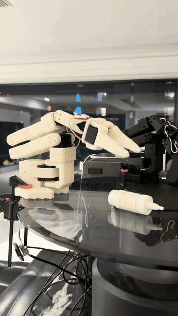

# Reall2Policy

End-to-end real-world robot learning on LeRobot SO-101.

<!-- readme:tagline:start -->
`100 demonstrations (target 100) · ACT E03 100K · Diffusion Policy · SmolVLA · OOD Generalization`
<!-- readme:tagline:end -->

<!-- readme:footnote:start -->
> 进度由 `lab-log/metrics.json` 生成；实验数字以 `experiments/INDEX.md` 与 `results/` 为准，未测完不写成功率。
<!-- readme:footnote:end -->

## Demo

<table>
  <tr>
    <td align="center" valign="top">
      
      <br />
      Leader臂（黑）不动 | Follower臂（白）独自抓放，远视角
    </td>
    <td align="center" valign="top">
      
      <br />
      同一抓放任务的接近与落位，近视角
    </td>
  </tr>
  <tr>
    <td align="center" valign="top">
      
      <br />
      连续 Scraping：策略自主连续作业
    </td>
    <td align="center" valign="top">
      
      <br />
      Corrective demonstration（纠正示教）
    </td>
  </tr>
</table>

## 当前进度

课表与全部可复制命令：**[docs/COURSE.md](docs/COURSE.md)**

<!-- readme:progress:start -->
| 周 | 状态 |
|---|---|
| W0 环境 / W1 遥操 | 完成 |
| W2 Dataset | 100/100 episodes |
| W3 ACT | E01/E02/E03 均完成 100K |
| W4 拔 Leader | 完成 demo.mp4 |
| W5–6 Eval/OOD | 完成；Cam 19/90；Pos/Obj 0 |
| W7 Flywheel | ACT-v2 训练中，20K 已落 |
| W8–W12 | 未开始 |
<!-- readme:progress:end -->

Architecture → Results → Benchmark → Failure Analysis → Reproduction：随周次补齐。

## 本机启动

1. 双击 `start.cmd`
2. `verify.cmd`
3. 按 [docs/COURSE.md](docs/COURSE.md) 执行当周命令

Windows 环境细节见 [使用说明.md](使用说明.md)。实验台账：`lab-log/`。刷新 README 进度：`sync-readme.cmd`。

## 仓库

```
configs/     act / diffusion / smolvla
data/        本地 demonstration（不上 Hub）
docs/        课表与方法
experiments/ E01–E08
results/     eval / ACT vs DP
assets/      Demo
scripts/     sync-readme.py、评测与部署（W4 起）
```

`env/`、`cache/`、`outputs/` 不进 Git。

## 许可证

`lerobot/` 为 Apache 2.0。其余项目文件同样 Apache 2.0。
