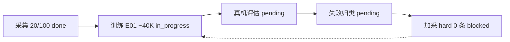

# 学习进程与曲线

数据：[`metrics.json`](metrics.json)（2026-09-10 03:22）。规范：Skill 内 `charts-spec.md`。

对话看板（可在聊天旁打开）：[学习看板](C:\Users\18431\.cursor\projects\d-SO-ARM101\canvases\learning-dashboard.canvas.tsx)

## 学习进程（12 周完成度 %）

整体约 **23%**（各周算术平均）。

```mermaid
xychart-beta
    title 12周课表完成度
    x-axis ["W0","W1","W2","W3","W4","W5-6","W7","W8","W9-10","W11","W12"]
    y-axis "完成度 %" 0 --> 100
    bar [100, 100, 20, 40, 0, 0, 0, 0, 0, 0, 15]
```

W2=20/100 ep；W3=E01 约 40K/100K；W12=GitHub 已建、Demo 未做。

## 项目收益（计划 vs 已兑现，0–10）

```mermaid
xychart-beta
    title 各周作品集收益
    x-axis ["W0","W1","W2","W3","W4","W5-6","W7","W8","W9-10","W11","W12"]
    y-axis "分" 0 --> 10
    bar [2, 4, 6, 7, 9, 8, 8, 9, 9, 6, 10]
    bar [2, 4, 3, 4, 0, 0, 0, 0, 0, 0, 2]
```

第一组 = 课表计划分；第二组 = 已兑现（无真机成功率则 W4 仍为 0）。

主要缺口：W4 拔 Leader 真机 Demo（计划 9，兑现 0）。

## 学习曲线（ACT E01）

20K 前 loss 约 7.0→0.13，未画入。纵轴从稳定段起。

```mermaid
xychart-beta
    title ACT E01 loss 与 l1_loss
    x-axis [20, 22, 24, 30, 33, 35, 37, 39, 40]
    y-axis "loss" 0.07 --> 0.14
    line [0.127, 0.121, 0.111, 0.098, 0.092, 0.088, 0.085, 0.083, 0.082]
    line [0.111, 0.107, 0.101, 0.090, 0.086, 0.084, 0.081, 0.080, 0.078]
```

| step | loss | l1 |
|------|------|-----|
| 20K | 0.127 | 0.111 |
| 30K | 0.098 | 0.090 |
| 40K | 0.082 | 0.078 |

03:21 已写入 `checkpoints/040000`（存盘成功）。

## 数据回收飞轮



阻塞：训练正在读 `so101_pick_place_20260910_011033`，不能对同一 root `resume` 录制。回收第 1 轮尚未转起来。
