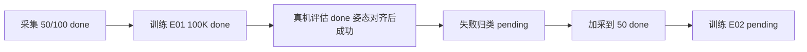

# 学习进程与曲线

数据：[`metrics.json`](metrics.json)（2026-09-10 23:17）。规范：Skill 内 `charts-spec.md`。

## 学习进程（12 周完成度 %）

整体约 **31%**（各周算术平均）。

```mermaid
xychart-beta
    title 12周课表完成度
    x-axis ["W0","W1","W2","W3","W4","W5-6","W7","W8","W9-10","W11","W12"]
    y-axis "完成度 %" 0 --> 100
    bar [100, 100, 50, 33, 40, 0, 0, 0, 0, 0, 15]
```

W2=50/100 ep（E02 数据齐）；W3=E01 完成、E02 待训；W4=rollout 通、Demo 未录。

## 项目收益（计划 vs 已兑现，0–10）

```mermaid
xychart-beta
    title 各周作品集收益
    x-axis ["W0","W1","W2","W3","W4","W5-6","W7","W8","W9-10","W11","W12"]
    y-axis "分" 0 --> 10
    bar [2, 4, 6, 7, 9, 8, 8, 9, 9, 6, 10]
    bar [2, 4, 4, 6, 5, 0, 0, 0, 0, 0, 2]
```

第一组 = 课表计划分；第二组 = 已兑现。W4 有成功 rollout，尚无 `assets/demo.mp4`。

## 学习曲线（ACT E01）

20K 前 loss 约 7.0→0.13，未画入。

```mermaid
xychart-beta
    title ACT E01 loss 与 l1_loss
    x-axis [20, 22, 24, 30, 33, 35, 37, 39, 40, 100]
    y-axis "loss" 0.04 --> 0.14
    line [0.127, 0.121, 0.111, 0.098, 0.092, 0.088, 0.085, 0.083, 0.082, 0.051]
    line [0.111, 0.107, 0.101, 0.090, 0.086, 0.084, 0.081, 0.080, 0.078, 0.051]
```

| step | loss | l1 |
|------|------|-----|
| 20K | 0.127 | 0.111 |
| 40K | 0.082 | 0.078 |
| 100K | 0.051 | 0.051 |

最终权重：`checkpoints/100000`。

## 数据回收飞轮



下一环：训 E02（`outputs/train/act_so101_e02`）。之后再 +50→100 训 E03。
